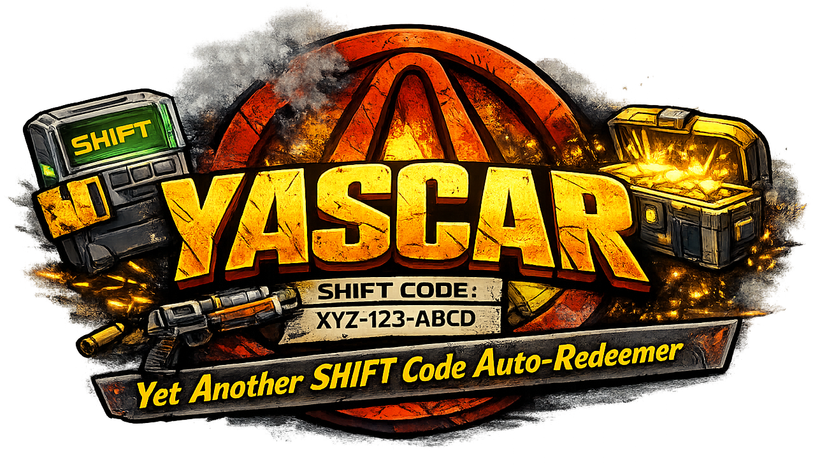
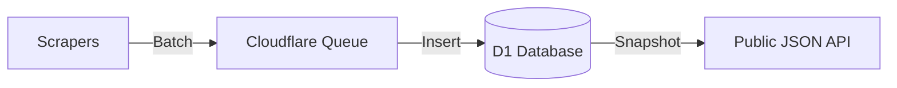

<p align="center">
  
</p>

<p align="center">
  <strong>Automatically claim your SHiFT codes for Borderlands games — no more missing out on loot!</strong>
</p>

<p align="center">
  <a href="https://github.com/KeeganFargher/YASCAR/releases/latest">
    
  </a>
  <a href="https://github.com/KeeganFargher/YASCAR/releases">
    
  </a>
  <a href="https://github.com/KeeganFargher/YASCAR/stargazers">
    
  </a>
</p>

---

## 🎮 What is YASCAR?

**YASCAR** (**Y**et **A**nother **S**hift **C**ode **A**utomatic **R**edeemer) is a free desktop app that helps you automatically redeem SHiFT codes for your favorite Borderlands games.

> **SHiFT codes** are special codes released by Gearbox that give you free in-game rewards like Golden Keys, skins, and more! The problem? They expire quickly and are scattered across social media. YASCAR solves this by automatically finding and redeeming them for you.

### ✨ Features

- 🔍 **Automatic Code Discovery** — We scan multiple sources for new codes every 30 minutes
- 🎁 **One-Click Redemption** — Redeem all available codes with a single click
- 🎯 **Smart Filtering** — Only see codes for the games YOU play
- 🔒 **Secure** — Your credentials never leave your computer
- 🌐 **Cross-Platform** — Available for Windows, macOS, and Linux

---

## 📥 Download

Choose the right version for your computer:

| Platform | Download |
|----------|----------|
| **Windows** | [Download .msi Installer](https://github.com/KeeganFargher/YASCAR/releases/latest) |
| **macOS (Apple Silicon)** | [Download .dmg](https://github.com/KeeganFargher/YASCAR/releases/latest) |
| **macOS (Intel)** | [Download .dmg](https://github.com/KeeganFargher/YASCAR/releases/latest) |
| **Linux** | [Download .deb / .AppImage](https://github.com/KeeganFargher/YASCAR/releases/latest) |

> 💡 **Not sure which to pick?** On Windows, download the `.msi` file. On Mac, download the `.dmg` that matches your chip (most newer Macs are Apple Silicon).

---

## 🚀 Getting Started

### Step 1: Install the App

1. Download the installer for your operating system from the links above
2. Run the installer and follow the prompts
3. Launch **YASCAR** from your applications

### Step 2: Log In to SHiFT

1. When the app opens, you'll see a login screen
2. Enter your **SHiFT account** credentials (the same login you use on [shift.gearboxsoftware.com](https://shift.gearboxsoftware.com))
3. Click **Log In**

> 🔐 **Is this safe?** Absolutely! Your password is sent directly to Gearbox's official servers — just like the official website. We never see or store your password.

### Step 3: Configure Your Games

1. Go to **Settings** using the sidebar
2. Select the Borderlands games you own
3. Choose your platforms (PC, Xbox, PlayStation, or all of them!)

### Step 4: Redeem Codes!

1. Go to the **Dashboard** to see all available codes
2. Click **Redeem All** to claim everything at once, or select individual codes
3. Watch your Golden Keys roll in! 🗝️

---

## 🎮 Supported Games

| Game | Status |
|------|--------|
| Borderlands: Game of the Year Edition | ✅ Supported |
| Borderlands 2 | ✅ Supported |
| Borderlands: The Pre-Sequel | ✅ Supported |
| Borderlands 3 | ✅ Supported |
| Tiny Tina's Wonderlands | ✅ Supported |
| Borderlands 4 | ✅ Ready on launch! |

---

## ❓ FAQ

<details>
<summary><strong>Is YASCAR safe to use?</strong></summary>

Yes! YASCAR is completely safe:
- Your credentials are sent directly to Gearbox's official SHiFT servers
- No passwords are ever stored or transmitted elsewhere
- The app is open-source — you can inspect the code yourself
- All code redemption happens through official Gearbox APIs
</details>

<details>
<summary><strong>Will I get banned?</strong></summary>

No. YASCAR uses the same redemption process as the official SHiFT website. It simply automates what you would do manually. We also include rate limiting to avoid overwhelming the servers.
</details>

<details>
<summary><strong>I don't have a SHiFT account. How do I make one?</strong></summary>

Head to [shift.gearboxsoftware.com](https://shift.gearboxsoftware.com) and click "Create Account". Make sure to link your gaming platforms (Steam, Epic, Xbox, PlayStation) to receive rewards!
</details>

<details>
<summary><strong>Where do you find the codes?</strong></summary>

We automatically scan multiple trusted sources including:
- MentalMars.com
- r/Borderlandsshiftcodes subreddit
- Various community trackers

New codes are discovered within 30 minutes of being posted!
</details>

<details>
<summary><strong>A code isn't working. What should I do?</strong></summary>

Some codes may have already expired or may only work for specific platforms. YASCAR will automatically mark failed codes and offer retry options. You can also check the original source for more details.
</details>

---

## 🌟 Show Your Support

If YASCAR helped you grab some sweet loot, consider:

- ⭐ **Starring this repo** — helps others discover YASCAR
- 🐛 **Reporting issues** — helps us make the app better
- 🤝 **Contributing** — developers are welcome!

---

## 🔧 For Developers

<details>
<summary><strong>Click to expand technical documentation</strong></summary>

### Architecture

YASCAR is a monorepo using a queue-based architecture with Cloudflare infrastructure:



### Projects

| Project | Description | Stack |
|---------|-------------|-------|
| `apps/scraper` | Scrapes codes, manages D1 database | Cloudflare Worker + D1 + R2 |
| `apps/web` | Marketing landing page | React + Vite (Cloudflare Pages) |
| `apps/desktop` | Desktop app for code redemption | Tauri + React |
| `packages/types` | Shared TypeScript types | TypeScript |
| `packages/shift-client` | SHiFT API client | TypeScript |
| `packages/user-config` | User preferences lib | TypeScript |

### Prerequisites

- Node.js 18+
- Rust (for desktop app development)
- Cloudflare Account (for scraper deployment)

### Setup

```bash
# Clone the repository
git clone https://github.com/KeeganFargher/YASCAR.git
cd YASCAR

# Install dependencies
npm install

# Build shared packages
npm run build -w @yascar/types
npm run build -w @yascar/shift-client
npm run build -w @yascar/user-config
```

### Running Locally

```bash
# Run scraper (needs wrangler login)
npm run dev:scraper

# Run web dev server
npm run dev:web

# Run desktop app
npm run dev:desktop
```

### Database Setup (One-time)

```bash
# Create the D1 database
npx wrangler d1 create yascar-codes

# Apply the schema
npx wrangler d1 execute yascar-codes --file=apps/scraper/schema.sql --local
```

### Contributing

1. Check existing issues/discussions
2. Create feature branch from `main`
3. Follow code style guidelines
4. Add tests for new functionality
5. Submit PR with clear description

For detailed architecture and implementation guides, see [agents.md](agents.md).

</details>

---

<p align="center">
  Made with 💛 for the Borderlands community
</p>
