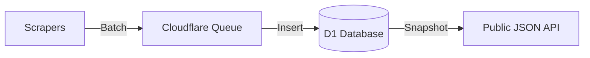

# YASCAR

**Y**et **A**nother **S**hift **C**ode **A**utomatic **R**edeemer

A monorepo for automatically scraping, storing, and redeeming SHiFT codes for Borderlands games.

## Architecture

We use a queue-based architecture with Cloudflare D1 as the source of truth:



## Projects

| Project | Description | Stack |
|---------|-------------|-------|
| `apps/scraper` | Scrapes codes, manages D1DB | Cloudflare Worker + D1 + R2 |
| `apps/web` | Marketing landing page | React + Vite (Cloudflare Pages) |
| `apps/desktop` | Desktop app for code redemption | Tauri + React |
| `packages/types` | Shared TypeScript types | TypeScript |

## Getting Started

### Prerequisites

- Node.js 18+
- Cloudflare Account (for deployment)
- Rust (for desktop app)

### Setup

1. Install dependencies:
   ```bash
   npm install
   ```
2. Build shared types:
   ```bash
   npm run build -w @yascar/types
   ```

### Running Locally

```bash
# Run scraper (needs wrangler login)
npm run dev:scraper

# Run web dev server
npm run dev:web

# Run desktop app
npm run dev:desktop
```

### Database Setup (One-time)

```bash
# Create the D1 database
npx wrangler d1 create yascar-codes

# Apply the schema
npx wrangler d1 execute yascar-codes --file=apps/scraper/schema.sql --local
```

## Supported Games

- Borderlands: Game of the Year Edition
- Borderlands 2
- Borderlands: The Pre-Sequel
- Borderlands 3
- Tiny Tina's Wonderlands
